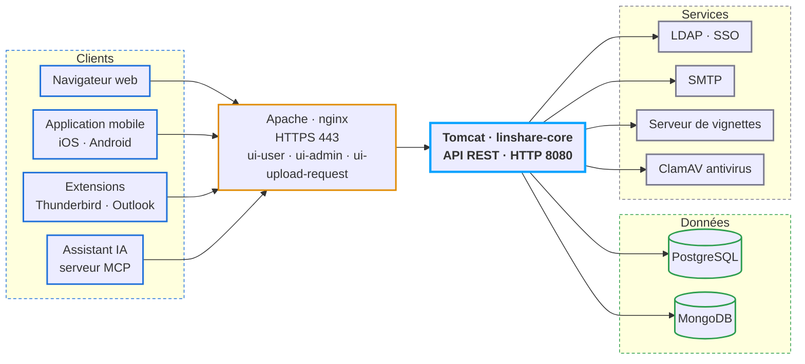

<p align="right"><a href="README.md">English</a> · <a href="README.fr.md">Français</a></p>

<p align="center">
  <picture>
    <source media="(prefers-color-scheme: dark)" srcset="documentation/img/linshare-logo-dark.svg">
    
  </picture>
</p>

<h3 align="center">Le partage de fichiers sécurisé et traçable, pour les organisations soucieuses de leur confidentialité.</h3>

<p align="center">
  <a href="LICENSE.md"></a>
  <a href="https://github.com/linagora/linshare/tags"></a>
  <a href="documentation/FR/README.md"></a>
  <a href="https://demo.linshare.org/"></a>
</p>

<p align="center">
  <a href="https://github.com/linagora/linshare/commits/master"></a>
  <a href="https://github.com/linagora/linshare/graphs/contributors"></a>
  <a href="https://github.com/linagora/linshare/stargazers"></a>
</p>

<p align="center">
  <a href="#essayer-linshare">Essayer LinShare</a> ·
  <a href="#installer">Installer</a> ·
  <a href="#documentation">Documentation</a> ·
  <a href="#composants-et-dépôts">Dépôts</a> ·
  <a href="#contribuer">Contribuer</a> ·
  <a href="https://linshare.app/">Site web</a>
</p>

---

## Qu'est-ce que LinShare ?

LinShare est une plateforme open source de partage de fichiers, conçue pour les organisations qui
doivent échanger des documents avec des collaborateurs internes et externes tout en gardant la
maîtrise de la confidentialité et de la traçabilité. Elle remplace les pièces jointes, les clés USB
et les services cloud grand public par un service hébergé sur votre propre infrastructure.

**Fonctionnalités clés**

- **Espace personnel** – déposez, versionnez et organisez vos fichiers, puis partagez-les par lien ou par courriel.
- **Espaces partagés** – groupes de travail avec rôles, dossiers imbriqués et disques partagés pour les équipes.
- **Invitations de dépôt** – demandez à des personnes externes de vous envoyer des fichiers via une boîte de dépôt sécurisée et à durée limitée.
- **Invités** – invitez des utilisateurs externes avec des comptes restreints et limités dans le temps.
- **Listes de contacts** – réutilisez des groupes de destinataires pour vos partages récurrents.
- **Journaux d'activité et audit** – chaque téléchargement, partage et modification est tracé.
- **Intégration en entreprise** – annuaires LDAP, SSO via LemonLDAP::NG et Microsoft Azure (OpenID Connect), JWT, analyse antivirus, aperçus de fichiers.
- **API REST** – automatisez tout depuis vos propres outils.
- **Assistants IA** – un [serveur MCP](https://github.com/linagora/linshare-mcp) permet à tout assistant compatible MCP de gérer fichiers, partages, invités et groupes de travail pour vous.

<p align="center">
  
</p>

## Nouveautés

**LinShare 6.5.4** (juillet 2026) :

- Les comptes invités peuvent désormais partager via des listes de contacts. Si aucune liste n'est affectée à l'invité, les listes de contacts publiques de son domaine d'origine deviennent utilisables comme destinataires.
- Correction d'une erreur de partage anonyme lorsqu'un invité restreint partage via une liste de contacts.
- Mise à jour depuis 6.5.3 : suivez le [guide de mise à jour](documentation/EN/upgrade/linshare-upgrade-from-v6.5.3-to-v6.5.4.md) [`EN`].

Les notes de version de chaque release, avec les changelogs par composant, sont dans [CHANGELOG.md](CHANGELOG.md).

## Essayer LinShare

### Démo en ligne

Une instance publique de la dernière version de LinShare est disponible sur **https://demo.linshare.org/**.
Elle est réinitialisée et mise à jour régulièrement.

<details>
<summary><strong>Comptes de démonstration et webmail</strong> (cliquer pour déplier)</summary>

Utilisateurs internes (mot de passe : `secret`) :

- abbey.curry@linshare.org
- amy.wolsh@linshare.org
- anderson.waxman@linshare.org
- cornell.able@linshare.org
- dawson.waterfield@linshare.org
- felton.gumper@linshare.org
- grant.big@linshare.org
- nick.derbies@linshare.org
- peter.wilson@linshare.org
- walker.mccallister@linshare.org

Destinataires externes (adresses sans compte LinShare) :
`external1@linshare.org` à `external5@linshare.org`.

Candidats invités (adresses externes que vous pouvez transformer en comptes invités) :
`guest1@linshare.org` à `guest5@linshare.org`.

Les courriels ne sont délivrés qu'aux adresses `@linshare.org`. Pour les lire, utilisez le webmail de démonstration
**https://demo-webmail.linshare.org** :

| Compte | Mot de passe |
|---|---|
| Utilisateurs internes `*@linshare.org` | `secret` |
| `external1@linshare.org` … `external5@linshare.org` | `password1` … `password5` |
| `guest1@linshare.org` … `guest5@linshare.org` | `password1` … `password5` |

</details>

### Lancer LinShare en local avec Docker

Le dépôt [linshare-docker](https://github.com/linagora/linshare-docker) fournit une pile `docker-compose`
avec le serveur, les interfaces web, PostgreSQL, MongoDB, un annuaire LDAP d'exemple, ClamAV,
un serveur de vignettes et un relais SMTP de test :

```bash
git clone https://github.com/linagora/linshare-docker.git
cd linshare-docker
docker-compose up -d
```

Ouvrez ensuite https://linshare.local (voir le README du dépôt pour les entrées `/etc/hosts`).

## Installer

Pour un déploiement en production, commencez par la matrice de compatibilité puis choisissez le guide de votre distribution.

| Étape | Guide |
|---|---|
| Vérifier les prérequis (OS, JVM, PostgreSQL, MongoDB, Tomcat, Apache) | [Matrice de compatibilité](documentation/FR/installation/requirements.md) |
| Installer sur Debian 12 (LinShare 6.x) | [Guide Debian 12](documentation/EN/installation/linshare-6.x-install-debian-12.md) [`EN`] |
| Installer sur Debian (versions plus anciennes) | [Guide Debian](documentation/FR/installation/linshare-install-debian.md) |
| Installer sur CentOS 7 | [Guide CentOS](documentation/FR/installation/linshare-install-centos.md) |
| Authentification unique (SSO) | [LemonLDAP::NG (en-têtes)](documentation/FR/installation/sso-lemonldap-using-headers.md) · [LemonLDAP::NG (OIDC)](documentation/FR/installation/sso-lemonldap-using-OIDC.md) · [Microsoft Azure (OIDC)](documentation/EN/installation/sso-microsoft-azure-using-OIDC-JWT-tokens.md) [`EN`] |
| Mettre à jour une instance existante | [Guides de mise à jour](documentation/FR/upgrade/README.md) |

Les paquets de chaque version (fichiers WAR, archives des interfaces, scripts SQL) sont publiés sur **http://download.linshare.org/versions/**.
Vous pouvez aussi récupérer tous les composants d'une version avec Maven depuis ce dépôt :

```bash
mvn dependency:copy-dependencies -DoutputDirectory='linshare'
```

## Documentation

Toute la documentation utilisateur est dans ce dépôt, sous [`documentation/`](documentation/).

| Guide | Français | English |
|---|---|---|
| Sommaire | [FR](documentation/FR/README.md) | [EN](documentation/EN/README.md) |
| Installation | [FR](documentation/FR/installation/README.md) | [EN](documentation/EN/installation/README.md) |
| Mise à jour | [FR](documentation/FR/upgrade/README.md) | [EN](documentation/EN/upgrade/README.md) |
| Guide utilisateur | [FR](documentation/FR/user/README.md) | [EN](documentation/EN/user/README.md) |
| Administration | [FR](documentation/FR/administration/README.md) | [EN](documentation/EN/administration/README.md) |
| Développement | [EN](documentation/EN/development/README.md) | [EN](documentation/EN/development/README.md) |
| API | [FR](documentation/FR/API/README.md) | [EN](documentation/EN/API/README.md) |

La traduction française est parfois en retard sur l'anglais. Les contributions à l'arborescence FR sont les bienvenues.

## Composants et dépôts

LinShare est découpé en plusieurs composants, chacun dans son propre dépôt. Ce dépôt est le
**dépôt principal** (*meta repository*) : il contient la documentation, les spécifications (EPIC et user stories)
et un agrégateur Maven (`pom.xml`) qui fixe la version de chaque composant pour une release.

### Architecture



Les ports, démons, fichiers de configuration et journaux sont détaillés dans le
[guide d'exploitation](documentation/FR/administration/exploitation-administration.md).

### Composants

| Composant | Rôle | Dépôt |
|---|---|---|
| linshare-core | Serveur (WAR Java, API REST, scripts SQL) | [linagora/linshare-core](https://github.com/linagora/linshare-core) |
| linshare-ui-user | Interface web utilisateur | [linagora/linshare-ui-user](https://github.com/linagora/linshare-ui-user) |
| linshare-ui-admin | Interface web d'administration | [linagora/linshare-ui-admin](https://github.com/linagora/linshare-ui-admin) |
| linshare-ui-upload-request | Interface publique des invitations de dépôt | [linagora/linshare-ui-upload-request](https://github.com/linagora/linshare-ui-upload-request) |
| linshare-mobile-flutter-app | Application mobile iOS et Android | [linagora/linshare-mobile-flutter-app](https://github.com/linagora/linshare-mobile-flutter-app) |
| linshare-mcp | Serveur MCP : permet aux assistants IA de gérer fichiers, partages, invités et groupes de travail via l'API REST | [linagora/linshare-mcp](https://github.com/linagora/linshare-mcp) |
| thumbnail-server | Génère les aperçus de fichiers | distribué avec le bundle de release |
| linshare-plugin-thunderbird | Extension Thunderbird pour envoyer les pièces jointes via LinShare | [linagora/linshare-plugin-thunderbird](https://github.com/linagora/linshare-plugin-thunderbird) |
| linshare-plugin-outlook | Complément Outlook pour envoyer les pièces jointes via LinShare | dépôt privé, non publié |
| linshare-docker | Pile Docker Compose pour les tests et démonstrations | [linagora/linshare-docker](https://github.com/linagora/linshare-docker) |

Tout cloner en une fois :

```bash
git clone https://github.com/linagora/linshare.git
git clone https://github.com/linagora/linshare-core.git
git clone https://github.com/linagora/linshare-ui-user.git
git clone https://github.com/linagora/linshare-ui-admin.git
git clone https://github.com/linagora/linshare-ui-upload-request.git
git clone https://github.com/linagora/linshare-mobile-flutter-app.git
git clone https://github.com/linagora/linshare-mcp.git
git clone https://github.com/linagora/linshare-plugin-thunderbird.git
git clone https://github.com/linagora/linshare-docker.git
```

## Contribuer

Les contributions sont les bienvenues : rapports de bugs, corrections de documentation, traductions, spécifications et code.

- Lisez [CONTRIBUTING.md](CONTRIBUTING.md) [`EN`] pour savoir où se fait le développement (le GitLab de Linagora
  est le dépôt de référence, GitHub est un miroir), comment signaler un problème, comment la documentation et
  les traductions sont organisées, et comment les fonctionnalités sont spécifiées en EPIC et user stories avant développement.
- Vous avez trouvé une faille de sécurité ? Suivez [SECURITY.md](SECURITY.md) [`EN`] plutôt que d'ouvrir un ticket public.
- Mettre en place un environnement de développement : voir le [guide du développeur](documentation/EN/development/README.md) [`EN`].

## Versions

Les notes de version, avec les liens vers les changelogs de chaque composant et vers le guide de mise à jour
correspondant, sont dans [CHANGELOG.md](CHANGELOG.md). Les paquets sont disponibles sur
http://download.linshare.org/versions/.

## Licence

LinShare est un logiciel libre publié sous la **GNU Affero General Public License v3**.
Voir [LICENSE.md](LICENSE.md) pour le texte complet.

LinShare est développé par [Linagora](https://linagora.com/). Plus d'informations sur **https://linshare.app/**.
