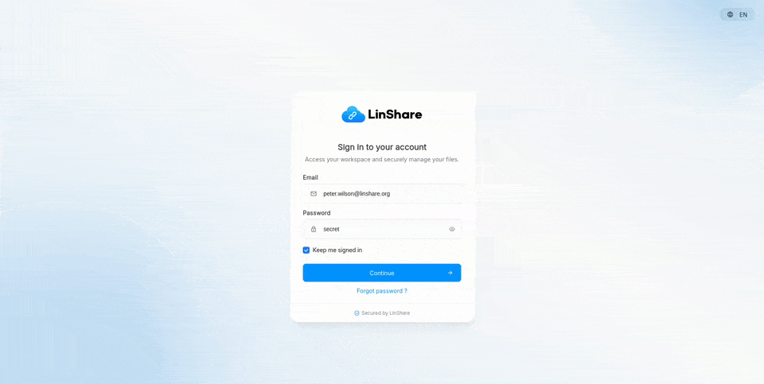
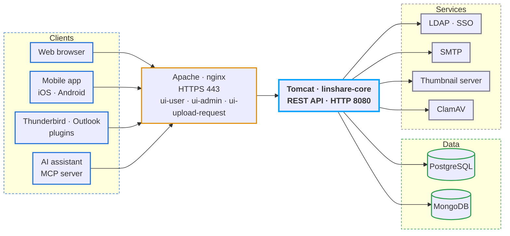

<p align="right"><a href="README.md">English</a> · <a href="README.fr.md">Français</a></p>

<p align="center">
  <picture>
    <source media="(prefers-color-scheme: dark)" srcset="documentation/img/linshare-logo-dark.svg">
    
  </picture>
</p>

<h3 align="center">Secure, traceable file sharing for organizations that care about privacy.</h3>

<p align="center">
  <a href="LICENSE.md"></a>
  <a href="https://github.com/linagora/linshare/tags"></a>
  <a href="documentation/EN/README.md"></a>
  <a href="https://demo.linshare.org/"></a>
</p>

<p align="center">
  <a href="https://github.com/linagora/linshare/commits/master"></a>
  <a href="https://github.com/linagora/linshare/graphs/contributors"></a>
  <a href="https://github.com/linagora/linshare/stargazers"></a>
</p>

<p align="center">
  <a href="#try-it">Try it</a> ·
  <a href="#install">Install</a> ·
  <a href="#documentation">Documentation</a> ·
  <a href="#components-and-repositories">Repositories</a> ·
  <a href="#contributing">Contributing</a> ·
  <a href="https://linshare.app/">Website</a>
</p>

---

## What is LinShare?

LinShare is an open-source file sharing platform built for companies that need to exchange documents
with internal and external collaborators while keeping full control over privacy and traceability.
It replaces email attachments, USB sticks and consumer cloud drives with a self-hosted service you
run on your own infrastructure.

**Key features**

- **Personal space** – upload, version and organize your files, then share them by link or email.
- **Shared spaces** – workgroups with roles, nested folders and shared drives for teams.
- **Upload requests** – ask external people to send you files through a secure, expiring drop box.
- **Guests** – invite external users with restricted, time-limited accounts.
- **Contact lists** – reuse groups of recipients for recurring shares.
- **Activity logs and audit** – every download, share and change is traced.
- **Enterprise integration** – LDAP directories, LemonLDAP::NG and Microsoft Azure SSO (OpenID Connect), JWT, antivirus scanning, file previews.
- **REST API** – automate everything from your own tools.
- **AI assistants** – an [MCP server](https://github.com/linagora/linshare-mcp) lets any MCP-compatible assistant manage files, shares, guests and workgroups on your behalf.

<p align="center">
  
</p>

## What's new

**LinShare 6.5.4** (July 2026):

- Guest accounts can now share through contact lists. When no list is assigned to the guest, the public contact lists of its source domain become usable as recipients.
- Fixed an anonymous share error when a restricted guest shares through a contact list.
- Upgrading from 6.5.3: follow the [upgrade guide](documentation/EN/upgrade/linshare-upgrade-from-v6.5.3-to-v6.5.4.md).

Full release notes for every version, with per-component changelogs, are in [CHANGELOG.md](CHANGELOG.md).

## Try it

### Live demo

A public instance running the latest LinShare release is available at **https://demo.linshare.org/**.
It is reset and updated on a regular basis.

<details>
<summary><strong>Demo accounts and webmail</strong> (click to expand)</summary>

Internal users (password: `secret`):

- abbey.curry@linshare.org
- amy.wolsh@linshare.org
- anderson.waxman@linshare.org
- cornell.able@linshare.org
- dawson.waterfield@linshare.org
- felton.gumper@linshare.org
- grant.big@linshare.org
- nick.derbies@linshare.org
- peter.wilson@linshare.org
- walker.mccallister@linshare.org

External recipients (email addresses without a LinShare account):
`external1@linshare.org` to `external5@linshare.org`.

Guest candidates (external addresses you can turn into guest accounts):
`guest1@linshare.org` to `guest5@linshare.org`.

Emails are only delivered to `@linshare.org` addresses. To read them, use the demo webmail at
**https://demo-webmail.linshare.org**:

| Account | Password |
|---|---|
| `*@linshare.org` internal users | `secret` |
| `external1@linshare.org` … `external5@linshare.org` | `password1` … `password5` |
| `guest1@linshare.org` … `guest5@linshare.org` | `password1` … `password5` |

</details>

### Run it locally with Docker

The [linshare-docker](https://github.com/linagora/linshare-docker) repository ships a `docker-compose`
stack with the server, both web interfaces, PostgreSQL, MongoDB, a sample LDAP directory, ClamAV,
a thumbnail server and a test SMTP relay:

```bash
git clone https://github.com/linagora/linshare-docker.git
cd linshare-docker
docker-compose up -d
```

Then open https://linshare.local (see the repository README for the `/etc/hosts` entries).

## Install

For a production deployment, start with the compatibility matrix and pick the guide for your distribution.

| Step | Guide |
|---|---|
| Check requirements (OS, JVM, PostgreSQL, MongoDB, Tomcat, Apache) | [Compatibility matrix](documentation/EN/installation/requirements.md) |
| Install on Debian 12 (LinShare 6.x) | [Debian 12 guide](documentation/EN/installation/linshare-6.x-install-debian-12.md) |
| Install on Debian (older releases) | [Debian guide](documentation/EN/installation/linshare-install-debian.md) |
| Install on CentOS 7 | [CentOS guide](documentation/EN/installation/linshare-install-centos.md) |
| Single sign-on | [LemonLDAP::NG (headers)](documentation/EN/installation/sso-lemonldap-using-headers.md) · [LemonLDAP::NG (OIDC)](documentation/EN/installation/sso-lemonldap-using-OIDC-opaque-tokens.md) · [Microsoft Azure (OIDC)](documentation/EN/installation/sso-microsoft-azure-using-OIDC-JWT-tokens.md) |
| Upgrade an existing instance | [Upgrade guides](documentation/EN/upgrade/README.md) |

Release packages (WAR files, UI bundles, SQL scripts) are published at **http://download.linshare.org/versions/**.
You can also fetch every component of a release with Maven from this repository:

```bash
mvn dependency:copy-dependencies -DoutputDirectory='linshare'
```

## Documentation

All user-facing documentation lives in this repository under [`documentation/`](documentation/).

| Guide | English | Français |
|---|---|---|
| Overview | [EN](documentation/EN/README.md) | [FR](documentation/FR/README.md) |
| Installation | [EN](documentation/EN/installation/README.md) | [FR](documentation/FR/installation/README.md) |
| Upgrade | [EN](documentation/EN/upgrade/README.md) | [FR](documentation/FR/upgrade/README.md) |
| User guide | [EN](documentation/EN/user/README.md) | [FR](documentation/FR/user/README.md) |
| Administration | [EN](documentation/EN/administration/README.md) | [FR](documentation/FR/administration/README.md) |
| Development | [EN](documentation/EN/development/README.md) | [EN](documentation/EN/development/README.md) |
| API | [EN](documentation/EN/API/README.md) | [FR](documentation/FR/API/README.md) |

The French translation sometimes lags behind English. Contributions to the FR tree are welcome.

## Components and repositories

LinShare is split into several components, each in its own repository. This repository is the
**meta repository**: it holds the documentation, the EPIC and user-story specifications, and a Maven
aggregator (`pom.xml`) that pins the version of every component for a release.

### Architecture



Ports, daemons, configuration and log paths are detailed in the
[exploitation guide](documentation/EN/administration/exploitation-administration.md).

### Components

| Component | Role | Repository |
|---|---|---|
| linshare-core | Backend server (Java WAR, REST API, SQL scripts) | [linagora/linshare-core](https://github.com/linagora/linshare-core) |
| linshare-ui-user | End-user web interface | [linagora/linshare-ui-user](https://github.com/linagora/linshare-ui-user) |
| linshare-ui-admin | Administration web interface | [linagora/linshare-ui-admin](https://github.com/linagora/linshare-ui-admin) |
| linshare-ui-upload-request | Public upload request interface | [linagora/linshare-ui-upload-request](https://github.com/linagora/linshare-ui-upload-request) |
| linshare-mobile-flutter-app | Mobile application for iOS and Android | [linagora/linshare-mobile-flutter-app](https://github.com/linagora/linshare-mobile-flutter-app) |
| linshare-mcp | MCP server: lets AI assistants manage files, shares, guests and workgroups through the REST API | [linagora/linshare-mcp](https://github.com/linagora/linshare-mcp) |
| thumbnail-server | Generates file previews | distributed with the release bundle |
| linshare-plugin-thunderbird | Thunderbird extension to send attachments through LinShare | [linagora/linshare-plugin-thunderbird](https://github.com/linagora/linshare-plugin-thunderbird) |
| linshare-plugin-outlook | Outlook add-in to send attachments through LinShare | private repository, not published |
| linshare-docker | Docker Compose stack for tests and demos | [linagora/linshare-docker](https://github.com/linagora/linshare-docker) |

Clone everything at once:

```bash
git clone https://github.com/linagora/linshare.git
git clone https://github.com/linagora/linshare-core.git
git clone https://github.com/linagora/linshare-ui-user.git
git clone https://github.com/linagora/linshare-ui-admin.git
git clone https://github.com/linagora/linshare-ui-upload-request.git
git clone https://github.com/linagora/linshare-mobile-flutter-app.git
git clone https://github.com/linagora/linshare-mcp.git
git clone https://github.com/linagora/linshare-plugin-thunderbird.git
git clone https://github.com/linagora/linshare-docker.git
```

## Contributing

Contributions are welcome: bug reports, documentation fixes, translations, specifications and code.

- Read [CONTRIBUTING.md](CONTRIBUTING.md) for where development happens (GitLab is the canonical
  upstream, GitHub is a mirror), how to report issues, how documentation and translations are
  organized, and how features are specified as EPICs and user stories before development.
- Found a security issue? Please follow [SECURITY.md](SECURITY.md) instead of opening a public issue.
- Setting up a development environment: see the [developer guide](documentation/EN/development/README.md).

## Releases

Release notes for every version, with links to the per-component changelogs and to the matching
upgrade guide, are in [CHANGELOG.md](CHANGELOG.md). Packages are available at
http://download.linshare.org/versions/.

## License

LinShare is free software released under the **GNU Affero General Public License v3**.
See [LICENSE.md](LICENSE.md) for the full text.

LinShare is developed by [Linagora](https://linagora.com/). More information at **https://linshare.app/**.
